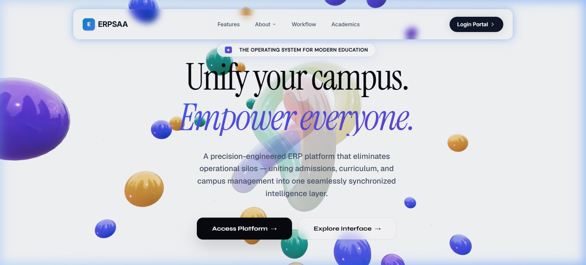
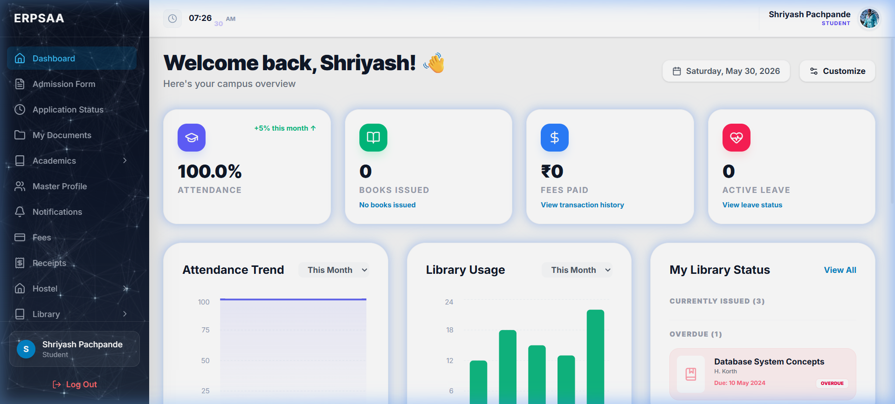

<!-- SEO & GitHub Search Optimization Keywords Header -->
<!--
Keywords: College ERP System, Student Academic Administration, MERN Stack College Management, Student Information System, SIS MERN, React 19 College ERP, Academic Timetable, Marks Management MERN, Higher Education ERP Suite, Open Source College ERP, School Management System, Stripe Fee Collection React, WhatsApp OTP authentication Node, GSAP Lenis React SPA
-->

<div align="center">

# 🎓 ERPSAA
### **Enterprise Resource Planning & Student Academic Administration**
#### *The Ultimate Ultra-Premium MERN Stack College Management & SIS Suite*

[](https://erpsaa-frontend.vercel.app/)
[](https://react.dev/)
[](https://nodejs.org/)
[](https://www.mongodb.com/)
[](https://tailwindcss.com/)

<p align="center">
  🌐 **[Live Production Server • Launch Web Experience 🚀](https://erpsaa-frontend.vercel.app/)**
  <br />
  <a href="#-key-modules--features">Explore Features</a>
  ·
  <a href="#-deep-technical-architecture">Deep Architecture</a>
  ·
  <a href="#-installation--local-setup">Setup Instantly</a>
  ·
  <a href="https://github.com/shriyashpachpande/ERPSAA/issues">Report Bug</a>
</p>

</div>

---

## 🖼️ Gorgeous Visual Interfaces

<div align="center">

### ✨ Dynamic Tech-Driven Landing Page


### 📊 Sleek Analytics-Rich Administrative Dashboard


</div>

---

## 🌟 Why ERPSAA?
**ERPSAA** is an ultra-premium, production-ready ERP platform engineered to manage the comprehensive, 360° academic lifecycle of higher education institutions. 

*   📱 **100% Device-agnostic & Fully Responsive**: Designed from the ground up with mobile-first layout methodologies using Tailwind CSS v4. Runs flawlessly, scales dynamically, and aligns beautifully across mobile smartphones, tablets, laptops, workstations, and high-DPI 4K displays.
*   ⚡ **0-Lag & Butter-smooth Optimization**: Built using highly optimized React lifecycle structures, virtualized lists, and dynamic code-splitting. Achieves a stutter-free **60 FPS to 120Hz refresh rate** performance using hardware-accelerated **GSAP & Framer Motion** transition libraries and low-overhead **Lenis** smooth scroll physics. No lag, no stutter—just instantaneous, high-performance interactions.

---

## 🚀 Key Modules & Feature Highlights

### 📅 1. High-Performance Academic Suite
*   **Dynamic Structure Management**: Define Academic Years, Semesters, Departments, Subjects, Sections, and multi-variable course mappings.
*   **Timetable Architect**: Highly visual class schedule calendar interfaces customized separately for Faculty profiles and Students.
*   **Mark Attendance Module**: Allows professors to record student daily attendance with automatic percentage calculations and summary sheets.
*   **Batch Marks Entry & Grading**: Advanced faculty marking sheet (supporting PT1, PT2, MSE, and End-Sem exams) featuring automatic aggregate checks and single-click **Result Sheets & GPA Generators**.
*   **Official Bonafide Portal**: Automated digital institutional Bonafide Certificate generation with validation and multi-tier approval flows.

### 🎟️ 2. Online Admission Desk & Document Vault
*   **Interactive Admission Form**: Comprehensive multi-step applicant registration flow with secure file upload systems for academic proofs, migration marksheets, and photos.
*   **Admission Status Tracker**: Stepper-based visual tracker showing progression: `Draft` ➡️ `Review` ➡️ `Under Verification` ➡️ `Approved/Rejected`.
*   **Staff Review Panels**: Streamlined applicant evaluation queues with approval and rejection controls.

### 💳 3. Digital Payments & Financial Ledger
*   **Online Fee Desk**: Integrated with Stripe payment gateway to support instant fee checkouts and multi-term installments.
*   **Interactive Accounts Ledger**: Detailed payment history tables with dynamically generated, downloadable, print-friendly digital receipts.
*   **Dynamic Cost Modeler**: Interactive billing setups and fee structure creators for accounts staff.

### 🏢 4. Integrated Hostel Operations
*   **Smart Room Allocator**: Visual allocation control sheets to easily allocate students to appropriate rooms, wings, and beds.
*   **Operations Register**: Comprehensive track boards for student check-ins/check-outs and occupancy analytic charts.
*   **Tenant Portal**: Dedicated student ticketing workspace for room maintenance requests, complaint boards, and quick emergency contacts.

### 📚 5. Next-Gen Library Administration
*   **Digital Book Catalog**: Modern searchable directory with live book availability, filters, and authors search.
*   **Borrow Logs & Requests**: Automated issue/return workflow, fine trackers for late returns, reservation queues, and damaged books reporting.

### 💬 6. Grievance Redressal & Event Booking
*   **Grievance Helpdesk**: Multi-tier student complaint workspace featuring real-time resolution timelines, priority stars, and automatic department queues.
*   **Facility & Venue Scheduler**: Permits student groups to register events and book campus grounds, gyms, auditoriums, and labs. Features active conflict check algorithms and Sports Teacher approval dashboards.

### 🔔 7. Automated WhatsApp OTP & Transaction Notifications
*   **Instant Notifications**: Fully integrated with `whatsapp-web.js` to send transactional OTP logins, successful payment receipts, admission updates, and academic notifications directly to students' WhatsApp accounts!

---

## 📸 Interactive System Overview
```text
                     +---------------------------------------+
                     |         ERPSAA CLIENT PORTAL          |
                     |  (Vite + React 19 + Tailwind v4 CSS)  |
                     +-------------------+-------------------+
                                         |
                                         | REST APIs & WebSockets
                                         v
                     +-------------------+-------------------+
                     |         ERPSAA BACKEND SERVER         |
                     |       (NodeJS + ExpressJS 5)          |
                     +--+------------------+---------------+--+
                        |                  |               |
                        | Mongoose         | SMS/OTP       | Payments
                        v                  v               v
            +-----------+-----------+ +----+-----+ +-------+-------+
            |      MONGODB DB       | | WHATSAPP | | STRIPE SYSTEM |
            | (Advanced Schemas with| | WEB API  | | (Digital Fees |
            | Composite Indexes)    | | (OTP/SMS)| | & Admissions) |
            +-----------------------+ +----------+ +---------------+
```

---

## 🛠️ Technological Stack

*   **Frontend**: React 19.x, Vite, Tailwind CSS v4.0, GSAP (GreenSock), Lenis Smooth Scroll, Framer Motion, Recharts, Three.js, React Router DOM.
*   **Backend**: Node.js, Express.js 5, MongoDB & Mongoose ORM, JWT, Bcryptjs, Multer, `whatsapp-web.js`, Stripe NodeJS SDK.

---

## 🔬 Deep Technical Architecture

### 🛡️ Secure Role-Based Access Control (RBAC) Route Guards
ERPSAA is built around a secure, declarative, RBAC layer in the React client, coupled with backend API middleware. In the frontend, the `ProtectedRoute` component intercepts navigation and validates the user's role against allowed access levels before mounting modules:

```javascript
// Dynamic RBAC Protection Model
<Route element={<ProtectedRoute allowedRoles={['super_admin', 'hostel_staff']} />}>
  <Route path="hostel/dashboard" element={<HostelDashboardPage />} />
  <Route path="hostel/allocation" element={<RoomAllocationPage />} />
</Route>
```

### 🗄️ Relational MDB Modeling & Stale Indices Prevention
To prevent database bloating and achieve high query execution speeds, ERPSAA uses selective mongoose references (.populate()) rather than deep nested subdocuments. Composite indexes are actively declared to protect transactional data consistency:

```javascript
// Multi-Variable Composite Index to enforce unique record-sets
InternalMarksRecordSchema.index(
  { studentMasterId: 1, academicYearId: 1, semesterId: 1, sectionId: 1, subjectId: 1 }, 
  { unique: true }
);
```

#### 🔧 Core Bugfixes & Infrastructure Audit:
*   **Stale MongoDB Unique Index Resolution**: Successfully mitigated legacy `studentId_1...` unique constraints inside the `internalmarksrecords` collection that caused bulk upsert failures (`E1100 Duplicate Key Error` for `studentId: null`).
*   **Populate Nesting Resolution**: Restructured server-side populate targets to correctly map deep student keys (`personalDetails.fullName`) inside Marks Queries, maintaining robust UI state integration.

---

## 🚀 Installation & Local Setup

### 📋 Prerequisites
*   Node.js `v22.x` or higher
*   MongoDB local instance or Atlas URI
*   Stripe Developer keys (Optional)

---

### Step 1: Clone the Repository
```bash
git clone https://github.com/shriyashpachpande/ERPSAA.git
cd ERPSAA
```

### Step 2: Server Setup & Configuration
1. Navigate to the server folder:
   ```bash
   cd server
   ```
2. Install dependencies:
   ```bash
   npm install
   ```
3. Create a `.env` file:
   ```env
   PORT=5000
   MONGO_URI=mongodb://127.0.0.1:27017/erpsaa
   JWT_SECRET=your_super_secure_jwt_secret_key_here
   NODE_ENV=development
   STRIPE_SECRET_KEY=your_stripe_secret_key
   ```
4. Run server:
   ```bash
   npm run dev
   ```

*(Note: On first startup, the self-hosted WhatsApp module will generate a QR code in your console. Scan it using your WhatsApp app to enable instant messaging, or comment the imports in `server.js` to disable it.)*

---

### Step 3: Client Setup & Configuration
1. Open a new terminal and enter client folder:
   ```bash
   cd client
   ```
2. Install dependencies:
   ```bash
   npm install
   ```
3. Boot development server:
   ```bash
   npm run dev
   ```
4. Navigate to `http://localhost:5173` in your browser!

---

## 🛡️ Secure Persona Matrix
The core architecture enforces dynamic permissions across 9 specialized user roles:
*   **Super / Academic Admin**: Full-scale institute parameters setup, department directories, and system logs.
*   **HOD (Head of Department)**: Allocates department faculty, manages timetables, and resolves escalated grievances.
*   **Faculty (Professors)**: Registers attendance, manages grades, syllabi progress checklists, and checks student leaves.
*   **Admission Staff**: Controls student applications lists, verify documents, and issues digital Bonafides.
*   **Accounts Staff**: Sets billing, processes refunds, and reviews transaction ledgers.
*   **Hostel Staff**: Room allocator panels, tenants register, and maintains room check-ins/outs.
*   **Library Staff**: Audits book requests, manages reservations, and tracks fines.
*   **Sport Teacher**: Approves stadium/court bookings and handles grounds slot schedules.
*   **Student**: Dashboard displaying timetables, marks sheets, receipts checkout, library logs, and leave applications.

---

## 📄 License & Contribution
This project is licensed under the MIT License - see the [LICENSE](LICENSE) file for details.

⭐ **Star this repository on GitHub to show your support!**
